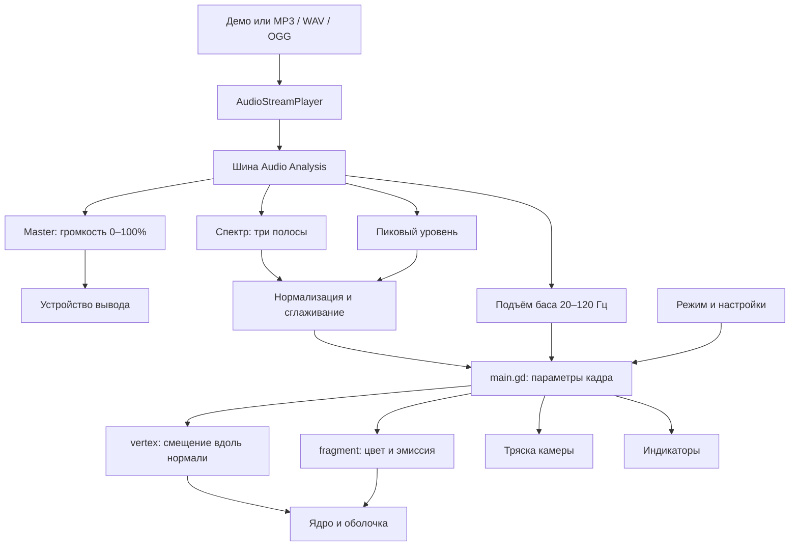

# Аудиоформа

Аудиоформа превращает музыку в движение трёхмерной сферы: бас расширяет объект и запускает направленные фронты, средние частоты создают крупные волны, высокие — мелкую рябь. Цветной контур, рост сферы на ударе и тряска камеры усиливают аудиореакцию.

Курсовой проект по дисциплине **«Программирование графики и звука»**. Тема: **«Преобразование аудиосигнала в деформацию 3D-меша в реальном времени с использованием вершинных шейдеров и аудиоанализа»**.

**Стек:** Godot **4.7.2**, GDScript, два пространственных шейдера, написанных кодом. Целевая сборка — Windows x86_64. Приложение работает с локальными файлами без подключения к интернету.

Документация описывает исходный код на **04.10.2026**, включая доработки после аудита. В разделе улучшений отдельно отмечены выполненные пункты и оставшиеся предложения.

## Содержание

- [Быстрый старт](#быстрый-старт)
- [Управление и режимы](#управление-и-режимы)
- [Настройка внешнего вида](#настройка-внешнего-вида)
- [Файлы и ограничения](#файлы-и-ограничения)
- [Решение проблем](#решение-проблем)
- [Запуск из исходников](#запуск-из-исходников)
- [Устройство проекта](#устройство-проекта)
- [Аудиоанализ](#аудиоанализ)
- [Шейдеры и изображение](#шейдеры-и-изображение)
- [Проверка и сборка](#проверка-и-сборка)
- [Соответствие заданию](#соответствие-заданию)
- [Подготовка к защите](#подготовка-к-защите)
- [Аналоги](#аналоги)
- [Возможные улучшения](#возможные-улучшения)
- [Источники и лицензии](#источники-и-лицензии)

## Быстрый старт

### Готовое приложение

1. Поместите `Audioforma.exe` в отдельную папку с правом записи: рядом сохраняются настройки.
2. Запустите EXE. Для использования готовой сборки устанавливать Godot, Python или дополнительные библиотеки не требуется.
3. Нажмите **«Воспроизвести»** для встроенного 24-секундного фрагмента «Спектральный этюд».
4. Нажмите **«Открыть аудио»** и выберите MP3, WAV или OGG Vorbis в системном диалоге Windows. Файл можно перетащить на окно. После успешной загрузки музыка играет сразу.
5. Настройте громкость ползунком под воспроизведением. При 0% музыка не слышна, но визуализация продолжает реагировать.
   Для перехода к фрагменту нажмите на шкалу времени или перетащите её ползунок; слева показана текущая позиция, справа — длительность.
6. Нажмите **F**, чтобы скрыть панели и центрировать сферу. **F** или **Esc** вернут интерфейс.

В рабочей папке сборка находится в `dist/Audioforma.exe`. Каталог `dist/` исключён из Git: клонирование исходников не предоставляет готовый EXE. Его нужно получить отдельно или собрать по инструкции ниже.

Требуется совместимый видеодрайвер: проект использует Compatibility / OpenGL 3.3. Требования движка приведены в [официальной документации](https://docs.godotengine.org/en/4.7/about/system_requirements.html). Поддержка конкретного компьютера подтверждается запуском на нём; исходное окно имеет размер 1280 × 720.

Окно можно развернуть стандартной кнопкой Windows. Сцена заполняет всю рабочую область без боковых полос, интерфейс сохраняет пропорции и привязку панелей к краям. Настройка `canvas_items` / `expand` расширяет доступную область при изменении соотношения сторон; см. [масштабирование Godot](https://docs.godotengine.org/en/4.7/tutorials/rendering/multiple_resolutions.html#stretch-aspect).

### Что показывает интерфейс

Слева — источник, воспроизведение, шкала времени, громкость и индикаторы. Справа — ракурс; снизу — режимы деформации. **«Настроить вид»** открывает прокручиваемую форму параметров.

Индикаторы показывают **нормированную активность** полос, а не процент энергии трека:

| Полоса | Диапазон | Основное влияние |
| --- | --- | --- |
| Басы | 20–250 Гц | Равномерное расширение и возвращение к исходному размеру |
| Середина | 250–2000 Гц | Крупные волны поверхности |
| Высокие | 2000–8000 Гц | Мелкая рябь |

Отдельный детектор анализирует подъёмы **20–120 Гц**. Обнаруженный удар запускает направленную волну, краткий рост сферы и тряску камеры. Постоянный низкий тон и ударный бас поэтому дают разные реакции.

## Управление и режимы

### Кнопки и клавиши

| Действие | Управление | Примечание |
| --- | --- | --- |
| Открыть файл | «Открыть аудио» или перетаскивание | Системный диалог Windows |
| Вернуть встроенный звук | «Демо» | Проигрывает демо с начала |
| Воспроизведение / пауза | Основная кнопка или **Пробел** | Пауза сохраняет позицию |
| Громкость | Ползунок, «−» / «+», **↓ / ↑** | 0–100%; шаг ползунка 1%, кнопок/клавиш — 10 процентных пунктов |
| Перемотка | Шкала времени, **← / →** | Перетащить и отпустить ползунок; клавиши меняют позицию на 5 с и работают в режиме F |
| Вращение сферы | Перетаскивание **левой кнопкой мыши** | В обычном режиме — на свободной области справа от панелей |
| Приближение / отдаление | Колесо, «+» / «−» панели «Ракурс» | Меняется расстояние камеры |
| Сброс ракурса | «Сброс» или **R** | Возвращает поворот и расстояние камеры |
| Настройки вида | «Настроить вид» или **S** | При показанных панелях |
| Скрытие / возврат панелей | «Просмотр · F» или **F** | Центрирует сферу |
| Выход из просмотра | **Esc** | Возвращает панели; не закрывает приложение |
| Выбор деформации | Кнопки или **1–4** | См. таблицу ниже |

Горячие клавиши получают события, которые не перехватил активный элемент интерфейса. Если ползунок или кнопка забирает клавишу, щёлкните по свободной области сцены. В режиме без панелей доступны мышь, колесо, Пробел, ↑/↓, R и 1–4.

### Четыре режима

| Клавиша | Режим | Смещения вершин |
| --- | --- | --- |
| **1** | Все | Пульс, рост на ударе, басовые фронты, средние волны, рябь |
| **2** | Пульс | Пульс баса, рост на ударе и басовые фронты |
| **3** | Волны | Волны средних частот |
| **4** | Рябь | Рябь высоких частот |

Режимы выбирают **геометрическую деформацию**. Цвет, световые детали и тряска продолжают получать общий анализ во всех режимах. Для проверки одной полосы используйте соответствующий тестовый тон и при необходимости отключите тряску.

В режиме F сфера центрируется за 0,4 секунды, камера приближается, вращение работает по всей свободной области окна. При выходе возвращается прежнее расстояние камеры; сделанный поворот сохраняется до R. F скрывает интерфейс внутри окна. Полноэкранное переключение сейчас не реализовано.

## Настройка внешнего вида

Нажмите **«Настроить вид»** или **S**. Прокрутите форму, если часть параметров не видна. Изменения применяются сразу и сохраняются автоматически после короткой задержки.

### Цвет и направление

- **Цвет контура** — основной выбранный цвет, с которым смешиваются палитра громкости и акценты полос.
- **Цвет фона** — окружение за объектом.
- **Тихий звук / Громкий звук** — начало и конец цветового перехода по уровню записи; по умолчанию синий и красный. Его вклад регулирует «Цвет от громкости».
- **Направление волны** — «Сверху вниз», «Снизу вверх», «Слева направо», «Справа налево», «В стороны», «Случайно». По умолчанию **«В стороны»**: пара противоположных фронтов. «Случайно» выбирает один из первых пяти вариантов для каждого удара.

Направление задаётся относительно сцены в момент удара и преобразуется в локальные координаты текущего поворота сферы. Далее фронт движется по поверхности и вращается вместе с объектом.

### Регуляторы

Числа — коэффициенты эффекта, а не физические единицы. Шаг визуальных регуляторов — 0,05, отображение значения — один знак после запятой.

| Параметр | Диапазон | По умолчанию | Действие |
| --- | --- | --- | --- |
| Цвет от громкости | 0–1 | 0,45 | Вклад перехода от цвета тихого к цвету громкого звука в основной цвет |
| Реакция цвета на спектр | 0–1 | 0,6 | Вклад спектральных акцентов: до 60% итогового цвета, чтобы переход по громкости оставался видимым |
| Свечение | 0–2 | 1 | Усиливает эмиссию и оболочку |
| Ширина контура | 0,5–2 | 1 | Распределение яркости вдоль силуэта |
| Деформация | 0–2 | 1 | Общая сила смещений вершин |
| Пульс баса | 0–2 | 1 | Реакция размера на басовую полосу |
| Рост на ударе | 0–2 | 1 | Краткое увеличение сферы и усиление свечения |
| Басовая волна | 0–2 | 1 | Направленные фронты и их световой акцент |
| Средние волны | 0–2 | 1 | Крупная волна и световые детали |
| Высокая рябь | 0–2 | 1 | Мелкая деформация и детали высоких частот |
| Чуткость баса | 0,5–2 | 1 | Больше — детектор замечает более слабые подъёмы |
| Тряска камеры | 0–2 | 1 | Сила смещений камеры; 0 отключает тряску |
| Скорость движения | 0,25–2 | 1 | Скорость волн и части световых деталей |
| Автовращение | 0–2 | 1 | Медленный поворот сферы; 0 отключает его |

«Чуткость баса» меняет пороги обнаружения ударов, а не усиление низкой полосы или громкость звука.

**«Сбросить»** возвращает исходные цвета, визуальные коэффициенты и направление. **«Готово»** закрывает форму и сохраняет отложенные изменения. Сброс вида не меняет громкость и ракурс; ракурс сбрасывается отдельно через R.

### Примеры настройки

Это варианты ручного выбора параметров. Библиотеки сохраняемых пресетов пока нет.

| Цель | Настройка |
| --- | --- |
| Один выбранный цвет | Цвет от громкости = 0, Реакция цвета на спектр = 0, выбрать цвет контура |
| Показать цвет от громкости на защите | Цвет от громкости = 1, Реакция цвета на спектр = 0, разные цвета тихого/громкого звука; один тон разной амплитуды |
| Спокойный просмотр | Тряска = 0, Рост на ударе около 0,5, Автовращение около 0,5 |
| Разобрать бас | «Пульс», направление «В стороны», отключить тряску |
| Увидеть середину / высокие | «Волны» / «Рябь», соответствующий коэффициент; тоны 800 / 5000 Гц |
| Неподвижный ракурс | Автовращение = 0, поворот мышью |

Начните с исходных значений и усиливайте эффекты по одному. Большие суммарные смещения плавно ограничены: вершины не проходят через центр, а увеличение сферы остаётся в рассчитанном диапазоне. На предельных усилениях форма становится менее естественной; радиальный ограничитель не заменяет физическую симуляцию.

## Файлы и ограничения

### Сохранение настроек

| Запуск | Файл |
| --- | --- |
| Из проекта | `.local/Audioforma.ini` в корне проекта |
| Автономный EXE | `Audioforma.ini` рядом с EXE |

В разделах `[appearance]` и `[audio]` сохраняются цвета, визуальные коэффициенты, направление и громкость. Ракурс, трек, позиция и режим деформации между запусками не сохраняются. Последняя папка выбора аудио запоминается только на текущий сеанс.

Запись происходит через **0,4 секунды** после последнего изменения. Дождитесь сохранения или нажмите «Готово». Быстрое завершение приложения сразу после регулировки может потерять последнее изменение.

При отсутствующем или нечитаемом INI используются исходные значения. Для полного возврата закройте приложение и переименуйте INI, сохранив копию. Следующий запуск использует исходные параметры, включая громкость 100%.

### Изоляция среды

- `.local/godot/` — редактор;
- `.local/godot/editor_data/` — данные автономного редактора и шаблоны;
- `.local/profile/` — профиль запуска через инструменты проекта;
- `.local/logs/` — журналы инструментов;
- `.local/test-profile/` и `.local/test-logs/` — отдельный профиль и журналы автоматических тестов;
- `.godot/` — импортированные ресурсы и кэш;
- `dist/` — сборка.

Эти каталоги исключены из Git. Скрипты временно перенаправляют `APPDATA` и `LOCALAPPDATA` для дочерних процессов, затем восстанавливают прежние значения.

При **прямом запуске EXE** INI остаётся рядом с приложением, но служебные журналы/кэш Godot могут использовать обычный `user://`, на Windows — `%APPDATA%/Godot/app_userdata/Аудиоформа`. Автономный режим редактора не распространяется на экспортированные приложения. См. [пути и self-contained mode Godot](https://docs.godotengine.org/en/4.7/tutorials/io/data_paths.html#self-contained-mode).

### Аудиофайлы и воспроизведение

Поддерживаются **MP3, WAV и OGG Vorbis**, которые читает Godot данной версии. OGG не гарантирует кодек Vorbis; произвольные кодеки контейнера не заявлены. FLAC, AAC/M4A и потоковые ссылки не поддерживаются.

Имя трека берётся из имени файла без расширения, длительность округляется до секунд. Приложение читает выбранную запись, не изменяет её и не отправляет в сеть.

Загрузка синхронная, без индикатора и ограничения размера: большой WAV может потребовать времени и памяти. При ошибке прежний источник остаётся выбранным. При перетаскивании нескольких файлов используется первый с поддерживаемым расширением; ошибка его чтения не запускает автоматический перебор остальных.

Перемотка сохраняет состояние воспроизведения: на паузе выбирается новая позиция без запуска звука. Пока ползунок перетаскивают, время показывает предполагаемую позицию; переход выполняется после отпускания. Клавиши ←/→ перемещают на 5 секунд. Переходы ограничены началом и длительностью записи. После окончания «Воспроизвести» запускает файл заново; можно заранее выбрать другой фрагмент и нажать «Продолжить».

Плейлист, отдельная остановка, микрофон/системный звук и экспорт видео пока отсутствуют. На паузе амплитуды аудиореакции затухают, автовращение и фоновые световые детали могут продолжать движение.

## Решение проблем

| Симптом | Что сделать |
| --- | --- |
| Нет звука | Нажать «Воспроизвести», проверить громкость приложения, системный микшер и устройство вывода |
| Сфера движется при 0% | Ожидаемое поведение: громкость изменяется после анализа |
| Постоянный бас не создаёт ударной волны | Детектор реагирует на подъём; равномерный тон в основном меняет размер |
| Мало движения | Выбрать «Все» / «Пульс», проверить общую деформацию и коэффициенты баса |
| Слабые волны или рябь | Проверить соответствующую полосу, отдельный режим и коэффициент; сравнить с тестовым тоном |
| Треки похожи визуально | Шкала анализа фиксирована; попробовать отдельные режимы. Адаптивной калибровки пока нет |
| Слишком тёмный объект | Сбросить настройки, проверить свечение и цвет; тёмное ядро — часть оформления |
| Слишком сильные складки поверхности | Уменьшить деформацию, средние волны и рябь; переход вершин через центр ограничен шейдером |
| Мешает тряска | Тряска камеры = 0 |
| Нет панелей | F или Esc |
| Не работает клавиша | Щёлкнуть свободную область, сняв фокус с элемента управления |
| «Поддерживаются файлы MP3, WAV и OGG Vorbis» | Выбрать подходящий формат; переименование расширения не меняет кодек |
| «Файл не найден или недоступен для чтения» | Проверить путь и права, выбрать файл повторно |
| «Не удалось прочитать аудиофайл» | Сравнить с исправным файлом или демо; предыдущий трек сохраняется |
| Не сохраняются настройки | Проверить право записи в папку EXE и сообщение в форме настроек |
| Интерфейс не помещается | Вернуть окно к размеру около 1280 × 720; малые окна требуют доработки |
| Не найден локальный Godot | Выполнить `tools/setup_local.ps1` с правильным каталогом |
| Ошибка памяти Godot в Windows | «ОК» завершает приложение. Для разбора сохранить журнал, версию/драйвер и момент сбоя |

В среде проверки появлялось `Failed to read the root certificate store`. В приведённом ниже прогоне оно не помешало локальному анализу и тестам. Другие ошибки требуют разбора по журналу.

## Запуск из исходников

### Требования

- Windows x86_64, PowerShell.
- Стандартная сборка **Godot 4.7.2**: обычный и консольный EXE. .NET-сборка не нужна.
- Git для истории.
- Python 3 со стандартной библиотекой для генераторов/шаблона экспорта; практичный вариант — 3.10 или новее. Пакеты из `pip` не требуются.

Редактор и шаблоны не входят в репозиторий. Все дальнейшие команды запускаются из корня с `project.godot`.

### Подготовка и запуск

Для новой копии:

```powershell
git clone https://github.com/PavelLeon1/Audioforma.git
Set-Location Audioforma
```

В существующей рабочей папке повторно клонировать не нужно. Подготовить локальный редактор:

```powershell
.\tools\setup_local.ps1
```

По умолчанию используется каталог текущей учебной среды. На другом компьютере укажите **папку с двумя EXE**, например:

```powershell
.\tools\setup_local.ps1 -GodotDirectory 'D:\Tools\Godot-4.7.2'
```

Нужные имена файлов:

```text
Godot_v4.7.2-stable_win64.exe
Godot_v4.7.2-stable_win64_console.exe
```

`GodotDirectory` принимает каталог, не путь к одному EXE. Скрипт копирует файлы в `.local/godot/` и создаёт `_sc_` для автономного редактора. Глобальная установка и изменение системного PATH не выполняются.

```powershell
.\tools\run.ps1
```

Скрипт предварительно импортирует ресурсы, запускает приложение и проверяет код завершения/ошибки разбора GDScript. Короткий запуск без окна:

```powershell
.\tools\run.ps1 -Headless -QuitAfter 120
```

`QuitAfter` — **число кадров**, не секунды. Headless не проверяет итоговое изображение и компиляцию шейдера видеодрайвером.

Открыть локальный редактор:

```powershell
& '.\.local\godot\Godot_v4.7.2-stable_win64.exe' --editor --path .
```

Для изолированной проверки приложения предпочтителен `run.ps1`: он дополнительно направляет профиль процесса внутрь `.local/`.

### Демо и тестовые данные

Файлы уже сохранены в репозитории. При намеренном пересоздании:

```powershell
python .\tools\generate_demo.py
python .\tools\generate_test_tones.py
```

Демо синтезировано локальным генератором: моно PCM 16 бит, 22 050 Гц, 24 секунды, фиксированное состояние генератора случайных чисел. Каждые шесть секунд добавляются бас, аккорд, шумовые ударные и дополнительный низкий тон. Участки помогают демонстрации, но не являются полностью изолированными полосами.

Тестовые WAV — тоны 80, 800 и 5000 Гц. В `tests/fixtures/` есть готовые MP3/OGG версии 800 Гц. Генератор тонов пересоздаёт только WAV.

### Git

```powershell
git status
git log --oneline -10
git remote -v
```

Сохранять законченные изменения удобно отдельными коммитами с коротким русским текстом: `feat: добавить ...`, `fix: исправить ...`, `docs: описать ...`. Выбирайте точные файлы по `git status`, учитывая исключённые локальные данные.

В этой рабочей копии `origin` настроен через HTTPS. Повторный `git remote add origin ...` не нужен. Отправка с другого компьютера требует собственной авторизации GitHub; приложение не хранит учётные данные.

## Устройство проекта

### Структура и ответственность

```text
project.godot                 Окно, имя приложения, renderer
scenes/main.tscn              Меш, оболочка, камера, свет, аудиоузлы
scripts/main.gd              Интерфейс, настройки, камера, связь с GPU
scripts/audio_controller.gd  Файлы, воспроизведение, шина и анализ
scripts/spectrum_mapper.gd   Нормализация и сглаживание
scripts/bass_beat_detector.gd Детектор подъёма баса
shaders/orb.gdshader         Деформация и тёмное ядро
shaders/halo.gdshader        Деформация и светящийся край
shaders/reactive_common.gdshaderinc Общие uniform, деформация и палитра
assets/audio/demo.wav        Встроенное демо
assets/icons/audioforma.png  Иконка проекта и окна
assets/icons/audioforma.ico  Иконка Windows с размерами 16–256 пикселей
tests/                       Модульные/интеграционные проверки
tests/fixtures/              Частотные сигналы
tools/                       Подготовка, запуск, тесты, экспорт
export_presets.cfg           Пресет Windows x86_64
README.md                    Руководство и описание
```

| Компонент | Основа Godot | Связи |
| --- | --- | --- |
| Сценарий Main (`main.gd`) | `Node3D` | Получает анализ, передаёт uniform обоим материалам, создаёт UI, управляет камерой/INI |
| `AudioController` | `Node` | Управляет AudioStreamPlayer и анализатором, сообщает `source_changed`/`playback_changed` |
| `SpectrumMapper` | `RefCounted`, статические методы | Преобразует числа анализа в 0–1, сглаживает полосы/уровень |
| `BassBeatDetector` | `RefCounted` | Хранит фон, историю уровня для окна 80 мс, пик, задержку и чувствительность |
| Два `.gdshader` | `Shader`, `spatial` | Вычисляют положение вершин и цвет пикселей двух слоёв |

### Поток данных



Сфера — `SphereMesh` радиуса **1,42**, высоты **2,84**, с 96 сегментами по окружности и 64 кольцами. Ядро и оболочка используют один ресурс меша с разными материалами; оболочка отодвинута вдоль нормали на 0,04.

GDScript не пересоздаёт вершины каждый кадр: положение вычисляет GPU-шейдер. `_process(delta)` обновляет поворот, получает полосы/уровень, регистрирует удар, обновляет его затухание, параметры материалов и индикаторы. Смена источника сбрасывает накопленные показатели проекта и визуальные импульсы.

`AudioController.get_position()` / `get_duration()` задают шкалу времени. `seek_to(seconds)` ограничивает позицию, перезапускает поток с выбранной секунды и сохраняет паузу; при достижении конца останавливает звук. Сигнал `playback_seeked` очищает басовые фронты, пульс, тряску и показания материалов. Перемотка пересоздаёт экземпляр спектроанализатора и даёт ему 60 мс на заполнение нового окна, чтобы прежний FFT не переносился в другой фрагмент. Громкость и настройки внешнего вида сохраняются.

Камера: угол обзора 58°, исходное расстояние 7, допустимое 5,6–9. Масштаб показывает отношение исходного расстояния к текущему. Мышь поворачивает сферу; вертикальный наклон ограничен ±1,15 радиана. Автоповорот — `0.12 * rotation_speed` радиана в секунду.

Удар кратко смещает камеру по X/Y синусоидами. Энергия тряски снижается на 6 в секунду; максимум длится около 0,17 с. UI находится в `CanvasLayer`, поэтому не трясётся вместе с 3D-сценой.

## Аудиоанализ

### Штатный FFT и метод проекта

AudioController создаёт шину **Audio Analysis → Master** с `AudioEffectSpectrumAnalyzer`: `FFT_SIZE_2048`, `buffer_length = 1.0`.

FFT вычисляет **Godot**. Собственная часть приложения — выбор диапазонов, объединение каналов, нормализация, сглаживание, детектор и связь с изображением. Анализатор не меняет звучание. Назначение FFT и компромисс задержки/стабильности описаны в [AudioEffectSpectrumAnalyzer](https://docs.godotengine.org/en/4.7/classes/class_audioeffectspectrumanalyzer.html).

Буфер 1 с означает длину хранения данных, не обязательную задержку ровно 1 с. Полная задержка зависит от вывода звука, окна анализа, кадров и сглаживания; измеренного значения для приложения пока нет.

`get_spectrum_analysis(delta)` возвращает `Vector3(bass, mid, high)` в пределах 0–1:

1. Проверяет, играет ли источник без паузы.
2. Запрашивает 20–250, 250–2000 и 2000–8000 Гц через `get_magnitude_for_frequency_range()`.
3. Использует `MAGNITUDE_MAX` и максимум между левым/правым каналами.
4. Нормализует показатели полос.
5. Отдельно обновляет детектор по 20–120 Гц с `MAGNITUDE_AVERAGE`.
6. Сглаживает и возвращает полосы.

`get_spectrum_analysis()` — метод **приложения**, `get_magnitude_for_frequency_range()` — API **Godot**. MAX выбирает максимум в диапазоне, не сумму энергии. См. [AudioEffectSpectrumAnalyzerInstance](https://docs.godotengine.org/en/4.7/classes/class_audioeffectspectrumanalyzerinstance.html).

Доминирующий тон и широкополосный шум одинаковой суммарной мощности могут дать разные значения; индикаторы не являются процентным распределением мощности.

### Нормализация и сглаживание

Для положительного линейного показателя `m` используется `linear_to_db(m)`:

```text
db = 20 * log10(m)
target = clamp((db + 66) / 66, 0, 1)
```

Неположительное значение даёт 0. Шкала −66…0 дБ принята для визуализации; она не измеряет акустическую громкость комнаты и не является калиброванным измерителем записи.

```text
tau = 0.055 с при росте; 0.22 с при снижении
weight = 1 - exp(-max(delta, 0) / tau)
next = current + (target - current) * weight
```

Быстрая атака показывает начало звука, медленный спад смягчает возвращение. Учёт `delta` уменьшает зависимость сглаживания от FPS. Постоянная времени не означает точного достижения конечного значения за этот срок.

Общий `level` берётся из максимального пикового уровня каналов Audio Analysis:

```text
target_level = clamp((peak_db + 60) / 60, 0, 1)
```

Далее применяется тот же фильтр. Это **пиковый уровень**, не RMS, LUFS или модель воспринимаемой громкости. Шкалы фиксированы; адаптивной нормализации трека, отдельных усилений анализа полос и настройки их границ сейчас нет.

### Басовый удар

Детектор использует несглаженный `MAGNITUDE_AVERAGE` диапазона 20–120 Гц, максимум каналов и фон с постоянной времени 0,65 с. Усреднение уменьшает маскировку удара одним постоянным низким тоном; для трёх основных полос сохранён MAX. Удар принимается при одновременном выполнении условий:

- текущий уровень ≥ **−45 дБ**;
- превышение над фоном ≥ **2,6 / sensitivity дБ**;
- рост за окно **80 мс** ≥ **1,2 / sensitivity дБ**;
- после предыдущего события прошло ≥ **0,14 с**;
- после прошлого события уровень успел снизиться относительно его пика хотя бы на **1,2 / sensitivity дБ**.

Сила — `clamp(contrast / 7, 0.4, 1.0)`. Первое значение не ниже −45 дБ устанавливает фон без события: начальная тишина не становится искусственным фоном −120 дБ. Пауза/смена источника сбрасывают детектор. Значение в начале окна восстанавливается линейной интерполяцией истории; чувствительность ограничена 0,5–2.

Это эвристика подъёма баса, не вычисление BPM. Она не гарантирует каждый музыкальный удар. Фиксированное временное окно уменьшает зависимость порога от FPS, а спад перед повторным событием защищает от нескольких волн на одном подъёме. Получение FFT остаётся привязано к обновлению кадра: при очень низком FPS или перекрывающихся ударах события могут пропускаться. Результаты при 30/60/144 FPS приведены ниже.

### Пользовательская громкость

```text
AudioPlayer → Audio Analysis → Master → устройство вывода
                 анализ       громкость пользователя
```

100% — линейный множитель 1; 50% — 0,5; 0% — 0. Процент не является линейным процентом воспринимаемой громкости. Master стоит после анализа, поэтому снижение звука не меняет форму. См. [аудиошины Godot](https://docs.godotengine.org/en/4.7/tutorials/audio/audio_buses.html).

## Шейдеры и изображение

### Вершинная часть

Оба `.gdshader` используют `shader_type spatial`. Деформация в `vertex()`:

```glsl
vec3 direction = normalize(NORMAL);
VERTEX += direction * offset;
```

Меняется положение вершин **трёхмерного меша**. Встроенные переменные и стадии описаны в [Spatial shaders](https://docs.godotengine.org/en/4.7/tutorials/shaders/shader_reference/spatial_shader.html).

Обозначения: `b/m/h` — полосы, `p` — импульс удара, `t` — время, `s` — скорость, `a = atan(z,x)`, `k_*` — пользовательские коэффициенты. Слагаемые смещения:

```text
Пульс:       0.24*b*k_bass + 0.34*p*k_beat
Середина:    0.28*m*k_mid*sin(5.5*y + 3*a - 4*t*s)
Рябь:        0.14*h*k_high*sin(23*x + 15*t*s)*sin(23*y - 13*t*s)
Басовый фронт: 0.38*k_wave*(front_a + front_b)
```

Режим выбирает слагаемые, общий `shape_strength` их усиливает. Оба материала подключают `reactive_common.gdshaderinc`: формулы формы и палитры находятся в одном месте. После суммирования применяется `bounded_offset`; оболочка добавляет отступ 0,04 уже после ограничения.

Для исходного радиуса `r` предел отрицательного смещения — `0.55*r`, положительного — `0.85*r`. До 65% соответствующего предела величина не меняется, далее экспоненциально приближается к нему:

```text
limit = r * (offset < 0 ? 0.55 : 0.85)
knee = 0.65 * limit
amount = min(abs(offset), knee)
       + (limit-knee) * (1-exp(-max(abs(offset)-knee, 0)/(limit-knee)))
safe_offset = sign(offset) * amount
```

Для этой сферы, у которой исходные нормали радиальные, радиус ядра остаётся в пределах **0,45–1,85 исходного радиуса** (около 0,639–2,627). Это сохраняет небольшие реакции и не даёт большим отрицательным волнам пройти через центр. Обоим слоям задан `extra_cull_margin = 1.25`, покрывающий максимальное расширение и отступ оболочки.

Для удара передаются время, сила, локальное направление и признак пары. Угловое расстояние от начала волны задаёт гауссов фронт:

```text
age = текущее время - время удара
front = strength * exp(-((angle - 4*age*s)/0.22)^2) * exp(-0.9*age)
```

Он активен при `0 <= age < 1.1` с. Два чередующихся слота позволяют перекрыть два события; новый удар заменяет более старый слот. Парная волна использует два противоположных направления.

`beat_pulse` снижается на 4,5 в секунду: максимальный импульс длится около 0,22 с. Это отдельный рост поверх длительной реакции баса.

### Цвет и свечение

Фрагментная часть оставляет тёмное ядро и усиливает силуэт/детали. Край определяется углом между нормалью и направлением взгляда.

Общая функция `audio_color()` сначала получает переход между `quiet_color` и `loud_color` по `smoothstep(0.12, 0.90, level)`, затем смешивает его с выбранным цветом контура через `loudness_color_mix`. Спектральный цвет — смесь фиолетового баса, розовой середины и бирюзовых высоких, взвешенная значениями полос.

Вклад спектра равен `spectrum_mix * 0.6 * smoothstep(0.02, 0.12, bass+mid+high)`: он затухает в тишине и занимает максимум 60% цвета. Остаётся вклад перехода по громкости даже при максимальном спектральном акценте. Палитра обоих материалов одинаковая. `level` также усиливает эмиссию и оболочку, удар добавляет световой акцент. Таким образом, **оттенок и интенсивность свечения зависят от уровня звука**, а форма и цветовые акценты сохраняют различия частот.

Исходная сила цветового перехода — 0,45. Старые INI без новых полей получают эту величину и исходные цвета; остальные сохранённые параметры продолжают загружаться. Для демонстрации требования используйте ненулевой «Цвет от громкости» и различающиеся цвета тихого/громкого звука. Пользователь может отключить эффект или выбрать одинаковые цвета — это настройка, а не отсутствие реализации.

Оболочка использует аддитивное смешивание без записи глубины. `EMISSION`, дополнительный светящийся слой и Glow окружения — разные этапы. В сцене Glow включён.

Renderer **Compatibility** поддерживает Glow, но использует реализацию с меньшим набором настроек; см. [постобработку Godot](https://docs.godotengine.org/en/stable/tutorials/3d/environment_and_post_processing.html#glow). Изменение renderer требует отдельной проверки изображения.

### Ограничения

- Нормали после деформации не пересчитываются: свет и край могут отставать от фактической сильной волны.
- Радиальный ограничитель рассчитан для текущей сферы с радиальными нормалями; при замене меша нужно заново проверить границы и запас отсечения.
- Время идёт на паузе, аудиореактивные амплитуды затухают.
- Визуализация художественная; физической модели упругой сферы нет.

## Проверка и сборка

### Автоматические проверки

```powershell
.\tools\test.ps1
```

Тесты используют **`.local/test-profile/`**, журналы **`.local/test-logs/`** и собственный временный INI. В `main.gd` путь настроек внедряется через `settings_path_override` до добавления сцены в дерево; обычный запуск использует прежний путь. После проверки временный INI удаляется. `test.ps1` сравнивает наличие и SHA-256 пользовательского `.local/Audioforma.ini` до/после: изменение считается ошибкой. Старые пользовательские параметры не задают начальные значения тестовой сцены.

Закройте обычный экземпляр приложения перед проверками, чтобы его самостоятельное автосохранение не меняло контролируемый файл одновременно. Отдельный тест можно запустить через `run.ps1 -Headless -TestRun -Script 'res://tests/test_visualizer.gd'`.

| Файл проверки | Тип | Что подтверждает |
| --- | --- | --- |
| `test_spectrum_mapper.gd` | Модульная | Нормализация, монотонность, ограничения, атака/спад, шкала уровня |
| `test_bass_beat_detector.gd` | Модульная | Ровный бас, подъём, защита от повторного события, сброс, чувствительность, медленный рост и обычные/плотные удары при 30/60/144 FPS |
| `test_audio_analysis.gd` | Интеграционная | Форматы/полосы/уровень, пауза и позиция, перемотка WAV/MP3/OGG с границами и повтором, независимость анализа от громкости, события демо |
| `test_bass_playback.gd` | Интеграционная | Настоящее воспроизведение и FFT демо/плотного PCM при 30/60/144 FPS; диапазон числа событий и допустимое расхождение между частотами кадров |
| `test_visualizer.gd` | Интеграционная | Параметры двух материалов, палитра и её сохранение/сброс, режимы, направление, пульс/тряска, ракурс, просмотр, шкала времени/перетаскивание/клавиши, файлы/ошибки |

`test.ps1` работает **без графического окна**. Наличие `vertex()` и правильных uniform не доказывает корректное изображение на GPU. Реальное взаимодействие с системным диалогом проверяется вручную.

### Исходный аудит 02.10.2026

Проверен код состояния `1d9fb48`, движок `4.7.2.stable.official.ed1daf0bf`. Все четыре группы прошли в отдельной копии с собственными настройками, кэшем и профилем. Результаты анализа:

| Вход | Басы | Середина | Высокие |
| --- | --- | --- | --- |
| WAV 80 Гц | 0,802 | 0,000 | 0,000 |
| WAV 800 Гц | 0,015 | 0,810 | 0,000 |
| WAV 5000 Гц | 0,000 | 0,025 | 0,804 |
| MP3 800 Гц | 0,000 | 0,809 | 0,007 |
| OGG Vorbis 800 Гц | 0,000 | 0,810 | 0,000 |

На тестовом участке демо зарегистрировано **6 басовых событий**. Небольшое значение соседних полос допустимо: измерение конечного окна и сжатые форматы не дают идеальной изоляции.

Обычный графический запуск проекта на 120 кадров и запуск существующего EXE из отдельной папки без ресурсов проекта завершились с кодом **0**. Среда: Compatibility / OpenGL 3.3 / Intel Iris Xe. Ошибок компиляции шейдеров в журналах этих запусков не было. Новая сборка при аудите не создавалась.

Дополнительный графический запуск `test_visualizer.gd` вывел PASS, однако его консольный launcher не завершился самостоятельно и был остановлен. Успешное завершение именно этого сценария не подтверждено. Во всех прогонах отмечено сообщение о хранилище сертификатов, описанное выше.

Эти результаты подтверждают логику и короткий запуск на одном компьютере. Длительное воспроизведение, внешний вид на другом GPU, точность каждого музыкального удара и все действия системного диалога требуют отдельной проверки. Журналы аудита оставлены во временной папке вне исходного проекта; здесь приведена сводка, а не самостоятельный протокол испытаний для записки.

### Проверка доработок 02.10.2026

Все **пять** групп прошли на том же движке. Частотные/форматные значения совпали с таблицей исходного аудита; тест анализа зарегистрировал 6 событий демо. Хэш пользовательского INI не изменился. Палитра тихого/громкого звука передаётся обоим материалам, сохраняется, восстанавливается и сбрасывается в изолированной тестовой сцене.

| Профиль | 30 FPS | 60 FPS | 144 FPS |
| --- | --- | --- | --- |
| Модульный, удары каждые 0,5 с, 3 с | 6 | 6 | 6 |
| Модульный, удары каждые 0,2 с, 3 с | 15 | 15 | 15 |
| Реальное воспроизведение демо, 4 с | 7 | 7 | 7 |
| Реальное воспроизведение плотного PCM, 4 с | 17 | 17 | 17 |

В дополнительном прогоне плотного PCM получено 16/17/17: граница четырёхсекундного окна и планирование аудио/кадров влияют на подсчёт. Это подтверждает устойчивость на этих сигналах, а не обнаружение каждого удара любой музыки. Модульная проверка также ограничивает расхождение времени события одним кадром 30 FPS с допуском 5 мс и не допускает событий при плавном росте уровня.

Для фактической функции `bounded_offset` из общего шейдера выполнена отдельная численная выборка 20 001 смещения от −10 до 10 при радиусе 1,42: радиус остался в диапазоне 0,639–2,627, небольшие смещения не изменились. Это проверка ограничения формы; она не проверяет растеризацию или качество освещения.

Графический запуск отрисовал профили тихого/громкого звука, отдельных полос и максимальных коэффициентов без ошибок компиляции шейдеров. Сохранить внешние снимки окна в этой среде не удалось, поэтому визуальное сравнение кадров не заявляется. Новый `dist/Audioforma.exe` экспортирован с общим shader include, прошёл запуск без графики из отдельной папки и **графический запуск на 120 кадров с кодом 0** без редактора. Среда — Compatibility / OpenGL 3.3 / Intel Iris Xe; предупреждение о сертификатах сохраняется.

Журналы: `.local/logs/improvement-tests.txt`, `.local/test-logs/*.log`, `.local/logs/improvement-build.txt`, `.local/logs/visual-proof.log`, `.local/logs/standalone_graphical.log`. Отдельный протокол для записки и оценка на компьютере защиты остаются следующими этапами.

### Окно и иконка — 04.10.2026

Графически проверены размеры 1280×720, 1600×840, 1280×1024, 1920×1040 и развёрнутое окно с рабочей областью 1920×991, включая режим F. Преобразование viewport покрывает рабочую область от (0,0) до размеров окна: отступов для чёрных полос нет, масштабы по X/Y совпадают с точностью округления пикселей. Тест интерфейса также прошёл.

Добавлена иконка аудиосферы с прозрачным фоном. PNG используется проектом, ICO — окном/панелью задач Windows и экспортируемым EXE. Проверка ресурсов готового EXE подтвердила совпадение изображений с ICO во всех обязательных размерах 16/32/48/64/128/256. Экспорт, автономный запуск и графический запуск развёрнутого EXE на 120 кадров завершились успешно. Журналы находятся в `.local/logs/window_layout.log`, `window-icon-ui-test.txt`, `window-icon-build.txt`, `window-icon-standalone.log`.

### Перемотка и громкость — 04.10.2026

Пять групп тестов прошли с сохранением пользовательского INI. Для WAV/MP3/OGG проверены переход во время звука, перемотка на паузе и продолжение с выбранной секунды, ограничения начала/конца, естественное завершение и повтор; громкость при этом сохраняется. Тест интерфейса проверяет предварительное время при перетаскивании, переход после отпускания, сброс старых эффектов, ←/→ в F и замену длинного трека коротким без ложной перемотки к его концу.

Графическая проверка компоновки прошла в исходном и развёрнутом окне: ползунок громкости имеет высоту 16 и центрируется в строке кнопок высотой 30; панели и нижние действия помещаются. Журналы: `.local/logs/seek-tests.txt`, `seek-ui-test.txt`, `seek_layout.log`, `seek-build.txt`.

### Ручная проверка перед демонстрацией

1. Проиграть демо целиком: звук, отличия участков, спад на паузе.
2. Загрузить 80/800/5000 Гц, сопоставить индикаторы с «Пульс»/«Волны»/«Рябь».
   Для зависимости цвета от громкости использовать один и тот же тон в двух файлах разной амплитуды: «Цвет от громкости» = 1, спектральный цвет = 0. Менять громкость прослушивания для этого опыта нельзя: она находится после анализа.
3. Загрузить реальные MP3 и OGG Vorbis, сравнить спокойный и плотный трек; отметить пропуски/ложные удары.
4. Проверить паузу с продолжением прежней позиции.
   Перемотать вперёд/назад во время звука и на паузе, перейти к началу/концу, проверить повтор и ←/→ в F; прежние волны не должны переноситься в новый фрагмент.
5. Во время проигрывания выставить 0%, затем вернуть громкость: анализ должен продолжаться.
6. Проверить направления, рост, тряску и отключение отдельных эффектов.
7. В F повернуть/приблизить сферу, изменить громкость и режим, выйти через Esc.
8. Проверить выбор/отмену/перетаскивание и ошибки отсутствующего, неподдерживаемого, повреждённого файла; предыдущий источник должен сохраниться.
9. Изменить настройки, дождаться сохранения, перезапустить; проверить цвета, направление и громкость.
10. Повторить демонстрацию в автономном EXE на компьютере защиты, включая нормальное завершение без ошибки памяти.

Результаты фиксируют с датой, версией, средой и реальными наблюдениями. Для записки нужны отдельные протоколы и иллюстрации опытной эксплуатации.

### Сборка Windows

```powershell
python .\tools\setup_export_template.py
.\tools\build.ps1
```

Подготовка шаблона требует интернета. Python-скрипт получает из официального TPZ только `version.txt` и `windows_release_x86_64.exe` через HTTP Range. Проверяет версию, длину и ZIP CRC32, сохраняет в `.local/godot/editor_data/export_templates/4.7.2.stable/`. CRC32 проверяет целостность фрагмента; официальный криптографический хэш сейчас не проверяется.

`build.ps1` импортирует и экспортирует **Windows Desktop** с `embed_pck`. Сцена, скрипты, шейдеры и демо встроены в **`dist/Audioforma.exe`**; отдельный PCK не требуется. См. [экспорт Windows Godot](https://docs.godotengine.org/en/4.7/tutorials/export/exporting_for_windows.html).

В пресете включено изменение ресурсов EXE и задан `assets/icons/audioforma.ico`; `config/icon` и `config/windows_native_icon` задают значок проекта и окна. У ICO есть версии 16/24/32/48/64/128/256 пикселей. Если Windows показывает прежнюю иконку у уже существовавшего файла, возможна задержка обновления её кэша; см. [иконки Windows в Godot](https://docs.godotengine.org/en/4.7/tutorials/export/changing_application_icon_for_windows.html#testing-the-result).

Скрипт проверяет ключевые ресурсы по журналу, включая `reactive_common.gdshaderinc`, отсутствие тестов/инструментов, EXE и отдельного PCK; копирует EXE в `.local/release-check/` и запускает без графики/редактора. Ненулевой код завершения EXE и ошибки скриптов/компиляции шейдеров в проверяемых журналах проваливают сборку.

**Сборка не запускает `test.ps1`.** Перед выпуском нужны отдельные изолированные тесты, экспорт и ручная графическая проверка: headless не подтверждает компиляцию и изображение на настоящем GPU.

Цифровая подпись сборки отключена. Размер EXE включает движок, а не только собственные ресурсы. Для публикации полезны версия, SHA-256, лицензии и привязка к коммиту.

## Соответствие заданию

Сверка выполнена по двум страницам `Леонов_Курсач_ПГиЗ.pdf`. Главная цепочка — **аудиоанализ → параметры → кодовый вершинный шейдер → деформация 3D-меша вдоль нормалей**.

| Требование | Реализация | Статус / демонстрация |
| --- | --- | --- |
| Реактивный 3D-объект в реальном времени | SphereMesh, параметры каждого кадра | Реализовано; показать силуэт и вращение |
| Смещение вдоль нормалей в vertex-шейдере | `VERTEX += normalize(NORMAL) * offset` | Реализовано; открыть обе вершинные части |
| `get_spectrum_analysis()`, три диапазона | Метод AudioController поверх Godot API | Реализовано; пояснить границы и нормализацию |
| Низкие — равномерное расширение/сжатие | Басовый пульс, возврат при спаде | Реализовано; 80 Гц и пауза |
| Средние — бегущие волны | Синусоидальная волна | Реализовано; 800 Гц / «Волны» |
| Высокие — рябь/вибрация | Две частые синусоиды | Реализовано; 5000 Гц / «Рябь» |
| Цвет и emission от громкости | `level` управляет переходом тихий/громкий и эмиссией; спектр добавляет акценты | Реализовано; один тон разной амплитуды при ненулевом «Цвет от громкости» |
| Собственные аудиофайлы | MP3/WAV/OGG Vorbis, диалог/drop | Реализовано; исправный и повреждённый файл |
| Режимы и вращение | Четыре режима, мышь/клавиши | Реализовано |
| Модульные проверки и испытания | Две модульные и три интеграционные группы | Есть; отдельный протокол ручных испытаний ещё нужен |
| Пояснительная записка | README — руководство и описание | **Ещё требуется:** отдельная записка |
| Графический материал А1 | По заданию Use Case | **Ещё требуется:** плакат; схема README его не заменяет |
| Приватный репозиторий по календарю | Публичный репозиторий по принятому решению | По уточнению 02.10.2026 оставляем публичным; поменяем видимость, если преподаватель потребует |

Календарь предусматривает подбор литературы к **08.10.2026**, основные классы к 01.11.2026, интерфейс к 15.11.2026, модульные тесты к **22.11.2026**, испытания к **28.11.2026**, работу над запиской к **08.12.2026**. Наличие приложения раньше сроков не отменяет остальные результаты.

В записке нужны введение; литературный обзор со ссылками; алгоритмический анализ с входом/выходом, функциональной схемой и взаимодействием классов; реализация и испытания; заключение; литература по ГОСТ; приложения с листингами, интерфейсом и результатами эксплуатации. Ссылки на протоколы должны вести к реально подготовленным документам.

## Подготовка к защите

### Короткое объяснение

«Аудиоформа воспроизводит файл через отдельную шину. Анализатор Godot получает спектр. Приложение выделяет и сглаживает три полосы, обнаруживает подъёмы баса и передаёт параметры пространственным шейдерам. Вершинная часть меняет вершины вдоль нормалей: бас — размер, середина — крупные волны, высокие — мелкая рябь. Фрагментная часть создаёт цвет и эмиссию. Интерфейс позволяет выбирать режимы, вращать объект и регулировать эффекты».

Перед защитой разберите код, которому соответствует объяснение. Важно различать механизмы движка и алгоритмы связи звука с графикой, реализованные в проекте.

### Демонстрация на 6–8 минут

1. **Цель и стек, до минуты.** Тема, сцена, выбор Godot и текстовых шейдеров.
2. **Общая реакция, около минуты.** Демо, три индикатора, поворот сферы.
3. **Диапазоны, 1–2 минуты.** Тоны 80/800/5000 из `tests/fixtures/`, соответствующие режимы, объяснение различий.
4. **Интерактивность, около минуты.** Свой файл, пауза/продолжение, перемотка, громкость без изменения анализа.
5. **Внешний вид, около минуты.** Цвет, направление, рябь, отключение тряски, F/Esc.
6. **Код, 1–2 минуты.** `get_spectrum_analysis()`, сглаживание, uniform, `vertex()` и `EMISSION`.
7. **Результаты.** Тесты, корректная ошибка файла, реальные ограничения и следующие шаги.

Подготовьте EXE, исходники, тоны, демо, разрешённую для демонстрации запись, пояснительную записку и А1. Проверьте всё на целевом компьютере.

### Вопросы по реализации

| Вопрос | Ответ по текущему коду |
| --- | --- |
| Где меняется геометрия? | `vertex()` изменяет `VERTEX`; `fragment()` определяет цвет пикселей |
| Зачем текстовый шейдер? | Явные формулы доступны для разбора и выполняются на GPU |
| Кто вычисляет FFT? | Godot; приложение выбирает/преобразует результаты |
| Спектр и громкость — одно? | Полосы отражают частотные составляющие; общий показатель — пик шины |
| Почему максимум? | Выделяет доминирующую составляющую, но не суммарную энергию полосы |
| Зачем нормализация? | Даёт диапазон 0–1 для интерфейса и uniform |
| Зачем атака и спад? | Быстрая реакция на начало и мягкое возвращение |
| Почему громкость независима? | Master расположен после Audio Analysis |
| Что такое удар? | Подъём 20–120 Гц относительно фона/прошлого значения с порогом и паузой |
| Вычисляется ли BPM? | Нет; используется локальная эвристика подъёма |
| Как бежит фронт? | Гауссов пик движется по угловому расстоянию от начала на сфере |
| Где настройки? | ConfigFile, `[appearance]`/`[audio]`, задержка записи 0,4 с |
| Что доказывают тесты без окна? | Числа и состояние компонентов; качество картинки проверяется отдельно |
| Зачем два слоя? | Тёмный объём ядра и усиленный цветной контур оболочки |
| Что требует завершения? | Учебные документы и ручная проверка на компьютере защиты; цвет от громкости реализован, репозиторий пока публичный по принятому решению |

## Аналоги

Сравнение по **официальной документации** на 02.10.2026. Приложения не устанавливались и не проходили сравнительных измерений; идеи для проекта — выводы из описанных подходов.

| Аналог | Подтверждённые возможности | Полезная идея | Связь с курсовым |
| --- | --- | --- | --- |
| [projectM](https://github.com/projectM-visualizer/projectm) | PCM/FFT, обнаружение ударов, OpenGL, пресеты с пиксельными шейдерами/уравнениями MilkDrop | Небольшой набор выразительных пресетов и разные реакции | Сохранять собственную 3D-деформацию при заимствовании подхода к настройкам |
| [Butterchurn](https://github.com/jberg/butterchurn) | WebGL MilkDrop, подключение AudioNode, переход между пресетами с временем смешивания | Плавная смена конфигураций, отделение аудиоисточника | Веб-вариант для обзора; текущий стек можно сохранить |
| [Synesthesia: управление](https://synesthesia.live/docs/manual/controls.html), [SSF](https://app.synesthesia.live/docs/ssf/ssf.html) | Кодовые GLSL-сцены, аудиопараметры, группы настроек, палитры/пресеты; SSF основан на fragment-шейдере | Разделить цвет/форму/движение, сделать общую реактивность понятной | Фрагментная генерация не заменяет требуемый vertex-шейдер |
| [Sonic Visualiser](https://www.sonicvisualiser.org/features.html) | Волна, спектрограмма, параметры анализа и аннотации | Диагностический просмотр полос/событий | Пример инструментального анализа, дополняющий художественную сферу |
| [Godot Spectrum Demo](https://github.com/godotengine/godot-demo-projects/tree/master/audio/spectrum) | Официальный пример спектрального анализатора | Сопоставление штатного API с собственными полосами | Курсовой добавляет 3D-деформацию, взаимодействие и оформление |

Из этого сравнения следует практичная рекомендация: несколько тщательно настроенных видов сферы, диагностика частот и устойчивый анализ. Большие библиотеки сцен, видеоэкспорт и системный звук увеличивают объём и не обязательны для основной темы.

## Возможные улучшения

Ниже отмечены выполненные доработки и оставшиеся предложения по результатам аудита. Приоритет «До защиты» связан с буквальным заданием; «Высокий» — с конкретной надёжностью; «Средний» — с качеством и проверяемостью; «Низкий» — с необязательным расширением. Объём сравнительный: малый / средний / большой.

### Выполнено после аудита

| Пункт | Результат |
| --- | --- |
| Цвет от громкости с сохранением частотной выразительности | Общая палитра по `level`, настраиваемые тихий/громкий цвета и сила перехода; спектральный акцент не перекрывает её полностью |
| Безопасное радиальное смещение | Плавное ограничение 0,45–1,85 радиуса ядра; максимальные коэффициенты отрисованы без ошибок шейдера |
| Изоляция тестов | Отдельный профиль/INI/журналы, проверка неизменности пользовательского файла |
| Детектор и частота кадров | Окно роста 80 мс, усреднение баса, повторное взведение после спада, интервал 0,14 с; модульные и реальные прогоны 30/60/144 FPS |
| Общие формулы и отсечение | `.gdshaderinc` для двух материалов, запас `extra_cull_margin = 1.25` |
| Контроль выпуска | Проверка кода завершения автономного EXE, наличие общего include и поиск ошибок шейдеров в журналах |
| Перемотка и строка громкости | Текущая позиция/длительность, ползунок и ←/→, сохранение паузы и сброс прежней реакции; громкость центрирована по высоте строки |

Видимость репозитория остаётся публичной по решению пользователя. Записка, протоколы и А1 будут подготовлены следующим этапом после проверки приложения по заданию.

### Требования и учебные материалы

| Приоритет / объём | Улучшение | Причина и критерий готовности |
| --- | --- | --- |
| До защиты / большой | Подготовить записку, протоколы испытаний и Use Case на А1 | Обязательные самостоятельные результаты. Структура, приложения и ссылки должны соответствовать заданию и версии программы |
| До защиты / средний | Сделать доказательную демонстрацию полос и амплитуды | Музыка смешивает реакции. Тоны и записи с разной амплитудой должны показывать ожидаемые форму/цвет/эмиссию |
| Средний / средний | Оформить литературный обзор и библиографию | Ссылки README не заменяют обзор. Объяснить FFT, сглаживание, обнаружение начала звука, vertex/fragment и выбор отображения |

### Надёжность и выпуск

| Приоритет / объём | Улучшение | Причина и критерий готовности |
| --- | --- | --- |
| Высокий / малый | Сохранять при закрытии, писать INI через временный файл | Таймер может не успеть; запись может прерваться. Быстрое закрытие сохраняет параметр, неудачная запись оставляет прежний файл |
| Высокий / средний | Проверить долгие графические сеансы и завершение на целевой машине | Были сообщения об ошибке памяти; графический тест оставил launcher работающим. Нужны условия воспроизведения либо устойчивые повторные запуски с журналами |
| Средний / средний | Проверять выпуск из чистой копии на второй среде | Кэш может скрыть зависимость. Чистые импорт/тесты/экспорт/автономный запуск должны проходить без исходной рабочей папки |
| Средний / малый | Добавить версию, привязку к коммиту, SHA-256 и готовый релиз | `dist/` не входит в клон. Пользователь должен получить конкретный проверенный EXE с описанием происхождения |
| Средний / малый | Проверять официальный хэш шаблона и версию редактора | CRC32/размер недостаточны для подтверждения происхождения. Неподходящий шаблон должен отвергаться до экспорта |
| Средний / малый | Передавать лицензии с выпуском, выбрать лицензию собственного кода | Публичность не задаёт условия использования. Уведомления движка/зависимостей и условия исходников должны быть доступны |
| Средний / средний | Довести переносимый EXE до локального профиля | Прямой запуск может писать в AppData. Проверка файлов должна подтвердить выбранную схему без глобальных настроек |

До ограничения при `shape_strength = mid_wave_strength = high_ripple_strength = 2`, `mid = high = 1` и отсутствии баса расчёт давал отрицательное смещение примерно `−1.12 − 0.56 = −1.68`, больше радиуса 1,42. Теперь `bounded_offset` применяется после суммирования и сохраняет положительный радиус. Сильные волны по-прежнему требуют оценки освещения и выразительности, особенно с исходными нормалями.

### Аудиоанализ и синхронизация

| Приоритет / объём | Улучшение | Причина и критерий готовности |
| --- | --- | --- |
| Средний / средний | Продолжить измерения на размеченных музыкальных фрагментах и очень низком FPS | Окно роста и тесты 30/60/144 уже добавлены; получение FFT остаётся кадровым. Проверять времена, пропуски и ложные события на реальной музыке |
| Средний / средний | Добавить усиления полос и ограниченную адаптивную калибровку | Фиксированная шкала уменьшает различия треков. Тихий сигнал видим, плотный не всегда на максимуме, тишина не усиливается |
| Средний / средний | Сравнить способы оценки трёх основных полос на тонах и шуме | Для детектора уже выбран AVERAGE, для полос сохранён MAX. Дальнейший выбор обосновать измерениями, сохранив обязательные диапазоны |
| Средний / средний | Измерить задержку, подобрать FFT/сглаживание | Большое окно и фильтр задерживают реакцию. Импульсный тест должен дать измеренное значение и обоснование компромисса |
| Средний / средний | Проверить 250/2000 Гц, тишину, стерео, частоты дискретизации и амплитуды | Три тона не покрывают границы. Значения должны быть конечными, предсказуемыми и монотонными в заявленных случаях |
| Средний / малый | Проверить переходы источников и выход из паузы на остаточный FFT | Сбрасываются числа проекта, но эффект не пересоздаётся. Старый сигнал не должен запускать заметные ложные события |

Для изучения альтернатив полезен **spectral flux** — положительные изменения спектра. См. первичное исследование [Simon Dixon, «Onset Detection Revisited», DAFx 2006](https://www.dafx.de/paper-archive/2006/papers/p_133.pdf). Его внедрение требует эксперимента; сейчас метод в проекте не реализован.

### Графика и производительность

| Приоритет / объём | Улучшение | Причина и критерий готовности |
| --- | --- | --- |
| Средний / средний | Обновлять нормали или обосновать упрощённый материал | Сильная волна меняет поверхность. Освещение/контур должны следовать форме без чрезмерной нагрузки |
| Средний / средний | Строгие диагностические режимы полос | Свет/тряска сейчас учитывают отключённые геометрические полосы. Диагностика должна показывать только выбранный вклад |
| Средний / средний | Проверить частоту ряби, плотность сетки и сглаживание | Мелкий эффект зависит от сетки/разрешения. Нужны выразительность без мерцания и рваного силуэта |
| Средний / средний | Измерить CPU/GPU-время, предложить небольшие уровни качества | Два слоя, прозрачность, тригонометрия и Glow имеют цену. Привести реальные FPS/время кадра, сохранять три реакции на слабом устройстве |
| Низкий / средний | Несколько пресетов с плавным переходом | Сейчас стиль настраивают вручную. Небольшая библиотека должна отличаться формой/цветом, сохраняться и сохранять связь со спектром |

Назначение `extra_cull_margin` и `custom_aabb` описано в [GeometryInstance3D](https://docs.godotengine.org/en/4.7/classes/class_geometryinstance3d.html).

### Интерфейс, доступность и файлы

| Приоритет / объём | Улучшение | Причина и критерий готовности |
| --- | --- | --- |
| Средний / средний | Адаптация размера окна и DPI | Многие размеры фиксированы. Основные действия должны помещаться при согласованном минимуме и 100/125/150% |
| Средний / малый | Понятная маршрутизация клавиш/фокуса | `_unhandled_input` зависит от UI. Пробел/F должны работать предсказуемо с сохранением настройки ползунков клавиатурой |
| Средний / средний | Группы цвета/формы/движения, точные числа, сброс группы | Форма длинная, шаг 0,05 отображается как 0,1. Настройку должно быть легко найти и повторить точно |
| Средний / малый | Быстрое отключение тряски и спокойный профиль | Сейчас нужно открыть форму. Снижение движения должно быть доступно и в просмотре F |
| Средний / средний | Состояние загрузки и пределы ресурсов | Большой/повреждённый файл может блокировать UI. Требуется понятная загрузка без зависания/чрезмерной памяти |
| Средний / малый | Постоянная последняя папка, ясный выбор нескольких drop-файлов | Папка забывается, ошибка первого файла прерывает перебор. Поведение должно быть явно определено и проверено |
| Средний / малый | Видимые ошибки сохранения вне формы вида | Изменение громкости может не сохраниться при скрытом сообщении. Пользователь должен увидеть ошибку записи |
| Низкий / малый | Полный экран и отдельный mute | F сохраняет рамку окна, 0% не хранит прежнюю громкость для возврата. Нужны понятный выход и сохранение трека |

### Сопровождение и проверяемость

| Приоритет / объём | Улучшение | Причина и критерий готовности |
| --- | --- | --- |
| Средний / средний | Разделить `main.gd` на UI, настройки и визуализацию | Один сценарий объединяет много задач. Компоненты должно быть проще объяснять и проверять без смены поведения |
| Средний / малый | Версия INI, проверки загрузки/сохранения | Формат сейчас без версии. Повреждённые поля должны давать безопасные значения; расширение сохранять совместимость |
| Средний / средний | Диагностический отчёт запуска и испытаний | Журналы перезаписываются. Нужны версия, renderer/GPU, тесты и коды выхода без пользовательских аудиоданных |
| Средний / средний | Автоматическая чистая проверка сборки | Сейчас шаги ручные. Фиксированный движок должен пройти независимые тесты/экспорт с сохранением локального процесса |
| Низкий / большой | Позже: микрофон/системный звук, видеоэкспорт, другие меши | Значительно расширяют задачу. Основная сфера и три реакции должны оставаться проверяемыми; расширения требуют отдельных требований |

### Порядок следующей работы

1. Ручная демонстрация трёх полос, двух амплитуд одного тона и режимов в новом EXE на компьютере защиты.
2. Проверка длительного воспроизведения/завершения и характера ударов на реальных треках; остальные улучшения надёжности — по результатам.
3. После подтверждения приложения — записка, протоколы испытаний и Use Case на А1.
4. Дополнительные удобства (адаптация интерфейса, пресеты) — отдельными согласованными доработками.

Переход оттенка, ограничение формы, изоляция тестов и проверки FPS уже выполнены. Последующие расширения сохраняют основную аудиореактивную 3D-деформацию. Репозиторий остаётся публичным, пока преподаватель не потребует иной видимости.

## Источники и лицензии

Ссылки нужны для изучения и проверки. В записке требуется отдельная литература по ГОСТ с датами обращения; исследование возможных улучшений не означает применение их алгоритмов.

### Godot

- [AudioEffectSpectrumAnalyzer](https://docs.godotengine.org/en/4.7/classes/class_audioeffectspectrumanalyzer.html) — параметры FFT.
- [AudioEffectSpectrumAnalyzerInstance](https://docs.godotengine.org/en/4.7/classes/class_audioeffectspectrumanalyzerinstance.html) — диапазоны и MAX/AVERAGE.
- [Audio buses](https://docs.godotengine.org/en/4.7/tutorials/audio/audio_buses.html) — маршрутизация.
- [Spatial shaders](https://docs.godotengine.org/en/4.7/tutorials/shaders/shader_reference/spatial_shader.html) — vertex/fragment.
- [Environment and post-processing](https://docs.godotengine.org/en/stable/tutorials/3d/environment_and_post_processing.html#glow) — Glow и renderer.
- [GeometryInstance3D](https://docs.godotengine.org/en/4.7/classes/class_geometryinstance3d.html) — отсечение.
- [File paths](https://docs.godotengine.org/en/4.7/tutorials/io/data_paths.html) — `res://`, `user://`, локальный редактор.
- [Exporting for Windows](https://docs.godotengine.org/en/4.7/tutorials/export/exporting_for_windows.html) — сборка.

### Теория и обзор

- [Julius O. Smith III, Spectral Audio Signal Processing](https://www.dsprelated.com/freebooks/sasp/) — авторский учебный материал по спектральному представлению аудио и временно-частотному анализу.
- [Simon Dixon, Onset Detection Revisited, DAFx 2006](https://www.dafx.de/paper-archive/2006/papers/p_133.pdf) — первичное исследование обнаружения начала звука и spectral flux.
- Официальные источники projectM, Butterchurn, Synesthesia, Sonic Visualiser и Godot Demo указаны в таблице аналогов.

### Лицензии

Приложение использует **Godot Engine**, распространяемый под MIT. Условия и уведомления — на [странице лицензии движка](https://godotengine.org/license/); правила передачи уведомлений — в [Complying with licenses](https://docs.godotengine.org/en/stable/about/complying_with_licenses.html).

Это лицензия движка. Отдельная лицензия собственного кода приложения в репозитории пока не задана. При публичном выпуске нужно передать требуемые уведомления сторонних библиотек движка. Пользовательские музыкальные записи не входят в комплект проекта.
